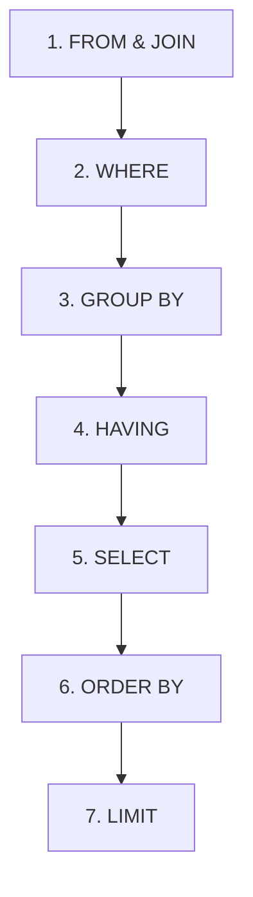

# TOPIK 7: GROUP BY & AGGREGATE FUNCTIONS

---

## 📊 APA ITU AGGREGATE FUNCTIONS?

Dalam SQL, **Aggregate Functions** adalah fungsi yang menerima sekumpulan data (banyak baris/row) dan mengembalikannya menjadi **satu nilai ringkasan (summary)**.

Bayangkan Anda memiliki daftar produk dan ingin tahu:
- Berapa jumlah total produk yang kita punya?
- Berapa total nilai stok barang kita?
- Berapa rata-rata harga produk?
- Berapa harga produk paling murah dan paling mahal?

Untuk menjawab pertanyaan-pertanyaan ini, kita menggunakan fungsi agregasi.

### 5 Fungsi Agregasi Utama:

| Fungsi | Kegunaan | Contoh Kasus |
| :--- | :--- | :--- |
| `COUNT()` | Menghitung **jumlah baris** | Menghitung jumlah pelanggan, jumlah transaksi |
| `SUM()` | Menjumlahkan **nilai numerik** | Menghitung total pendapatan, total unit terjual |
| `AVG()` | Menghitung **rata-rata** nilai numerik | Menghitung rata-rata nilai transaksi |
| `MIN()` | Mencari **nilai terkecil/minimum** | Mencari harga produk paling murah |
| `MAX()` | Mencari **nilai terbesar/maksimum** | Mencari harga produk paling mahal |

---

## 1️⃣ AGREGATE TANPA GROUP BY

Jika kita menggunakan fungsi agregasi langsung pada tabel tanpa `GROUP BY`, SQL akan memperlakukan **seluruh isi tabel sebagai satu grup besar** dan menghasilkan **satu baris output**.

### Contoh 1: Menghitung total baris (`COUNT`)
```sql
SELECT COUNT(*) AS total_produk FROM produk;
```
*Output:*
| total_produk |
| :--- |
| 11 |

> 💡 **Tips**: `COUNT(*)` menghitung seluruh baris termasuk baris yang berisi `NULL`. Jika Anda menulis `COUNT(kategori)`, SQL hanya menghitung baris yang kolom `kategori`-nya tidak bernilai `NULL`.

#### 🌟 Menghitung Data Unik dengan `COUNT(DISTINCT)`

Secara default, `COUNT(kolom)` akan menghitung semua baris (termasuk nilai yang duplikat/sama). Jika kita hanya ingin menghitung **jumlah data yang unik/berbeda**, kita gunakan `DISTINCT` di dalam `COUNT()`.

*   **Analogi**: Jika di dalam kelas ada Budi, Budi, dan Ani. 
    *   `COUNT` biasa akan menghitung **3** orang.
    *   `COUNT(DISTINCT)` akan menghitung **2** nama unik (Budi dan Ani).
*   **Contoh Query**:
    ```sql
    SELECT COUNT(DISTINCT kategori) AS jumlah_kategori_unik FROM produk;
    ```

### Contoh 2: Menghitung Total Stok (`SUM`) dan Rata-rata Harga (`AVG`)
```sql
SELECT 
    SUM(stok) AS total_stok, 
    AVG(harga) AS rata_rata_harga 
FROM produk;
```
*Output:*
| total_stok | rata_rata_harga |
| :--- | :--- |
| 354 | 1295454.55 |

### Contoh 3: Mencari Harga Termurah (`MIN`) dan Termahal (`MAX`)
```sql
SELECT 
    MIN(harga) AS harga_terendah, 
    MAX(harga) AS harga_tertinggi 
FROM produk;
```
*Output:*
| harga_terendah | harga_tertinggi |
| :--- | :--- |
| 50000 | 8000000 |

---

## 2️⃣ APA ITU GROUP BY & BAGAIMANA CARA KERJANYA?

Bagaimana jika kita ingin melihat total stok **untuk setiap kategori produk**? 
Kalau pakai query sebelumnya, kita harus menulis query `WHERE` untuk setiap kategori satu per satu. Ini sangat tidak efisien!

Di sinilah **`GROUP BY`** digunakan. `GROUP BY` digunakan untuk **mengelompokkan** baris data yang memiliki nilai yang sama ke dalam grup-grup kecil, lalu menjalankan fungsi agregasi pada masing-masing grup tersebut.

### Visualisasi Cara Kerja `GROUP BY`:

Bayangkan tabel `produk` seperti ini:
```
+-----------+---------------------+-------------+---------+
| id_produk | nama_produk         | kategori    | stok    |
+-----------+---------------------+-------------+---------+
| 1         | Laptop Dell         | Elektronik  | 5       |
| 2         | Mouse Logitech      | Aksesori    | 20      |
| 3         | Keyboard Mechanical | Aksesori    | 12      |
| 4         | Monitor LG 24 inch  | Elektronik  | 8       |
+-----------+---------------------+-------------+---------+
```

Saat kita menjalankan:
```sql
SELECT kategori, SUM(stok) FROM produk GROUP BY kategori;
```

SQL akan melakukan 3 langkah di balik layar:

#### Langkah 1: **Split** (Mengelompokkan berdasarkan kategori)
- **Grup Elektronik**:
  - Laptop Dell (stok: 5)
  - Monitor LG 24 inch (stok: 8)
- **Grup Aksesori**:
  - Mouse Logitech (stok: 20)
  - Keyboard Mechanical (stok: 12)

#### Langkah 2: **Apply** (Menghitung fungsi agregasi `SUM(stok)` per grup)
- **Grup Elektronik**: `5 + 8 = 13`
- **Grup Aksesori**: `20 + 12 = 32`

#### Langkah 3: **Combine** (Menggabungkan kembali hasilnya menjadi output)
```
+-------------+-----------+
| kategori    | SUM(stok) |
+-------------+-----------+
| Elektronik  | 13        |
| Aksesori    | 32        |
+-------------+-----------+
```

---

## ⚠️ ATURAN EMAS (THE GOLDEN RULE) GROUP BY

Banyak pemula mengalami error saat menggunakan `GROUP BY` karena melanggar aturan ini. Tolong diingat baik-baik:

> 🚨 **ATURAN EMAS**: 
> Setiap kolom yang Anda pilih di `SELECT` **HARUS** berupa:
> 1. Kolom yang berada di dalam fungsi agregasi (seperti `SUM(kolom)`, `COUNT(kolom)`), **ATAU**
> 2. Kolom yang dideklarasikan di dalam clause `GROUP BY`.

### Mengapa?
Mari kita lihat query yang **SALAH** ini:
```sql
-- ❌ QUERY INI AKAN MENYEBABKAN ERROR / DATA TIDAK KONSISTEN
SELECT kategori, nama_produk, SUM(stok) 
FROM produk 
GROUP BY kategori;
```

**Kenapa salah?**
Kategori `Elektronik` memiliki beberapa `nama_produk` (Laptop Dell dan Monitor LG). Jika data dikelompokkan menjadi satu baris per kategori, baris `Elektronik` harus menampilkan nama produk yang mana? Laptop atau Monitor? SQL tidak tahu dan akan bingung!

Di database modern (seperti MySQL versi baru dengan mode `ONLY_FULL_GROUP_BY` aktif, atau PostgreSQL), query di atas akan langsung menghasilkan error:
> *Expression #2 of SELECT list is not in GROUP BY clause and contains nonaggregated column...*

**Solusi yang benar:**
Jika Anda ingin menampilkan `nama_produk`, Anda harus memasukkannya ke dalam `GROUP BY` (artinya pengelompokan dilakukan berdasarkan Kategori DAN Nama Produk):
```sql
-- ✅ Query Benar
SELECT kategori, nama_produk, SUM(stok) 
FROM produk 
GROUP BY kategori, nama_produk;
```

---

## 3️⃣ FILTER DATA DENGAN HAVING CLAUSE

Dalam SQL, kita sudah mengenal `WHERE` untuk memfilter data. Namun, **`WHERE` tidak bisa digunakan untuk memfilter hasil dari fungsi agregasi.**

### Contoh Salah:
```sql
-- ❌ QUERY INI ERROR
SELECT kategori, SUM(stok) 
FROM produk 
WHERE SUM(stok) > 15 
GROUP BY kategori;
```
Kenapa error? Karena **`WHERE` dieksekusi sebelum pengelompokan (`GROUP BY`) terjadi.** Pada saat `WHERE` berjalan, SQL belum menghitung nilai `SUM(stok)`.

### Solusi: Gunakan `HAVING`
`HAVING` dirancang khusus untuk memfilter **hasil grup** atau **fungsi agregasi** setelah data dikelompokkan.

```sql
-- ✅ QUERY INI BENAR
SELECT kategori, SUM(stok) AS total_stok
FROM produk 
GROUP BY kategori
HAVING total_stok > 15;
```

### ⚔️ Perbedaan Utama `WHERE` vs `HAVING`:

| `WHERE` | `HAVING` |
| :--- | :--- |
| Memfilter baris data **sebelum** dikelompokkan | Memfilter grup data **setelah** dikelompokkan |
| Digunakan untuk kolom biasa (non-agregasi) | Digunakan untuk menyaring hasil agregasi |
| Ditulis **sebelum** `GROUP BY` | Ditulis **setelah`GROUP BY` |

### Bolehkan menggunakan keduanya?
**Boleh sekali!** SQL akan memfilter baris dengan `WHERE` terlebih dahulu, mengelompokkannya dengan `GROUP BY`, lalu memfilter hasil kelompok dengan `HAVING`.

```sql
-- Menghitung total stok per kategori, tapi hanya untuk produk yang harganya di atas 200,000, 
-- dan hanya menampilkan kategori yang total stoknya di atas 15 unit.
SELECT kategori, SUM(stok) AS total_stok
FROM produk
WHERE harga > 200000                  -- 1. Filter produk mahal dulu
GROUP BY kategori                     -- 2. Kelompokkan produk mahal tersebut
HAVING total_stok > 15;               -- 3. Filter grup yang total stoknya > 15
```

---

## 🏗️ SQL EXECUTION ORDER (URUTAN EKSEKUSI SQL)

Untuk benar-benar memahami cara kerja SQL, pahami urutan bagaimana database mengeksekusi query Anda. 
Urutan penulisan kode di editor Anda **berbeda** dengan urutan database menjalankannya!

### Urutan Penulisan (Syntax Order):
```sql
1. SELECT ...
2. FROM ...
3. JOIN ... ON ...
4. WHERE ...
5. GROUP BY ...
6. HAVING ...
7. ORDER BY ...
8. LIMIT ...
```

### Urutan Eksekusi oleh Database (Execution Order):


1. **`FROM` & `JOIN`**: Database mencari tahu dari tabel mana data akan diambil dan digabungkan.
2. **`WHERE`**: Baris data difilter berdasarkan kriteria tertentu.
3. **`GROUP BY`**: Baris-baris yang tersisa dikelompokkan ke grup-grup.
4. **`HAVING`**: Grup-grup hasil agregasi difilter.
5. **`SELECT`**: Kolom yang diinginkan dipilih dan alias (`AS`) dibuat. (Di sinilah fungsi agregasi dihitung).
6. **`ORDER BY`**: Output akhir diurutkan. (Kita bisa menggunakan alias di sini karena SELECT sudah dieksekusi).
7. **`LIMIT`**: Jumlah baris dibatasi untuk dikembalikan ke user.

---

## 🔗 COMBINING JOIN + GROUP BY (PENGGUNAAN UTAMA DI BACKEND)

Di dunia kerja nyata, Anda hampir selalu menggunakan `GROUP BY` bersamaan dengan `JOIN`. 
Misalnya, kita ingin menghitung **total uang yang dibelanjakan oleh masing-masing pelanggan**.

Tabel `pembelian` hanya menyimpan `id_pelanggan`, bukan `nama_pelanggan`. Jadi kita harus `JOIN` ke tabel `pelanggan` lalu melakukan `GROUP BY`.

### Langkah demi Langkah:

```sql
SELECT 
    pelanggan.nama_pelanggan,
    SUM(pembelian.total_harga) AS total_belanja
FROM pelanggan
INNER JOIN pembelian ON pelanggan.id_pelanggan = pembelian.id_pelanggan
GROUP BY pelanggan.id_pelanggan, pelanggan.nama_pelanggan
ORDER BY total_belanja DESC;
```

### Penjelasan Penting:
1. Kita melakukan `INNER JOIN` karena kita hanya ingin menghitung belanjaan pelanggan yang memang pernah bertransaksi.
2. Di bagian `GROUP BY`, kita menulis `pelanggan.id_pelanggan, pelanggan.nama_pelanggan`. 
   > 💡 **Kenapa id_pelanggan juga dimasukkan ke GROUP BY?** 
   > Ini adalah best practice! Dua pelanggan bisa saja memiliki nama yang sama (misal ada dua orang bernama 'Budi'). Mengelompokkan berdasarkan ID memastikan data belanjaan tidak tercampur secara salah antara pelanggan yang berbeda namun bernama sama.
3. `SUM(pembelian.total_harga)` akan menjumlahkan seluruh `total_harga` pembelian untuk masing-masing pelanggan tersebut.
4. Kita urutkan hasil belanjaan dari yang terbesar ke terkecil (`ORDER BY total_belanja DESC`).

*Output:*
| nama_pelanggan | total_belanja |
| :--- | :--- |
| Budi Santoso | 9050000 |
| Siti Nurhaliza | 1750000 |
| Dewi Lestari | 2700000 |
| Ahmad Hidayat | 1450000 |
| Roni Hermawan | 600000 |
| Lisa Manobal | 600000 |
| Sari Wijaya | 350000 |

Sekarang Anda sudah siap untuk berlatih! Buka file `latihan.sql` untuk mencoba membuat query agregasi sendiri.
